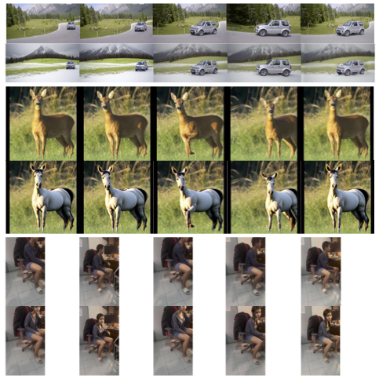

# CLEVAM-DM: Consistent Local Edits in Videos via Attention Manipulation in Diffusion Models

This repository contains the code and data for our 2025 DL course final project.

## Overview

Video editing with generative AI presents significant challenges in maintaining temporal consistency across frames. While diffusion models have demonstrated impressive capabilities in image generation and editing, their application to video often results in inconsistent transformations or unwanted global changes. We propose CLEVAM-DM, a novel approach that enables consistent local edits in videos through attention manipulation in diffusion models. Our framework operates through a sequential pipeline of keyframe preparation, consistent local editing, and video frame interpolation. By combining advanced inpainting, attention sharing mechanisms, and optical flow-guided frame synthesis, CLEVAM-DM achieves high-quality, temporally consistent local edits while preserving motion dynamics and background elements. Unlike existing approaches that require specialized video models or extensive training, our method operates efficiently on standard hardware, requires no additional training, and works with existing image-based diffusion models. Experiments demonstrate CLEVAM-DM's ability to produce coherent object transformations across diverse video content while maintaining visual fidelity and motion consistency.

We present some qualitative results of CLEVAM-DM. **Top**: original video frames. **Bottom**: processed frames. The first four processed frames are keyframes; the last column shows interpolated frames.



Our [poster](./assets/poster.pdf) and [final report](./assets/report.pdf) can be found in `assets/`.

## Setup

After cloning the repository, create a conda environment and install the required packages:

```bash
conda create -n clevam python=3.11.11
conda activate clevam
pip install -r requirements.txt
sudo apt update && apt install ffmpeg
```

Note that you need to manually choose the version for `cupy` in `requirements.txt` based on your CUDA version.

## Running the Pipeline

First, download the necessary pretrained weights.

- Download directory `segmentation_mask_brushnet_ckpt` and `realisticVisionV60B1_v51VAE` from [Google Drive](https://drive.google.com/drive/folders/1fqmS1CEOvXCxNWFrsSYd_jHYXxrydh1n) and place them in `cfg.brushnet_path`.
- Download [pre-trained checkpoint](https://huggingface.co/Mulns/PerVFI-v1-0/tree/main/PerVFI) named `v00.pth` and place it in `cfg.pervfi_path`.

All scripts are located in the `scripts` folder.

To run the pipeline, first specify the configurations in `src/config/config.yaml`. Please make sure all **folder** paths ends with `/`.
If you run into an OOM error, you can try to reduce the `chunk_size` in `config.yaml`.

Configurations you **should not** change:
```yaml
do_inverse: true # set to true to make the edits more aligned
interval: ... # automatically determined by time_per_keyframe
change_background: ... # automatically determined by the prompts
fps: ... # automatically determined by the input video
```

Also, make sure to set the environment variable `CUDA_HOME` to your CUDA installation path, e.g.,

```bash
export CUDA_HOME=/usr/local/cuda-11.4 # you might want to ls /usr/local to find the correct path
```

Then, you can run the pipeline with the following command:

```bash
sh scripts/run.sh
```

If you simply want to clear the intermediate files (**including** the final output video), you can run

```bash
sh scripts/clear.sh
```

You may need to delete `cached_download` in `diffusers/utils/dynamic_modules_utils.py` if you encounter an error related to `cached_download`.

You can check out `scripts/run.sh` to run python scripts separately.

Run `python -m src.app` to start the web app.
